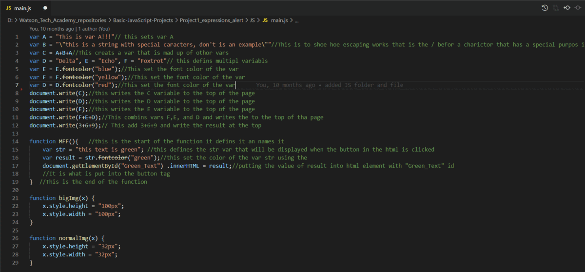
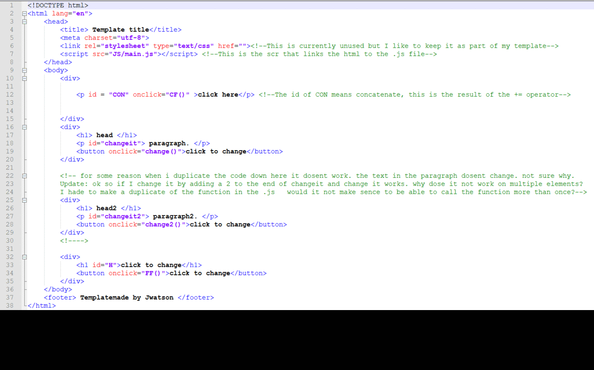
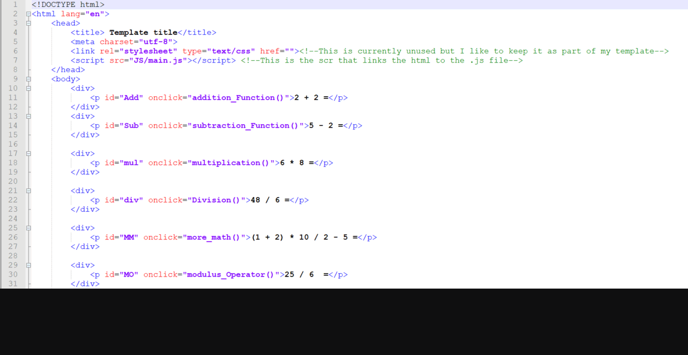
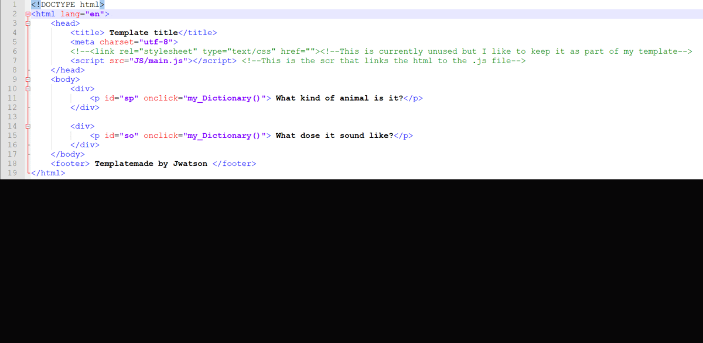
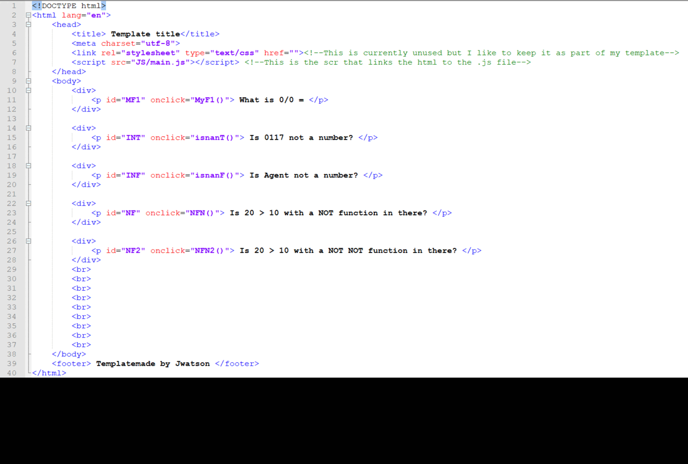
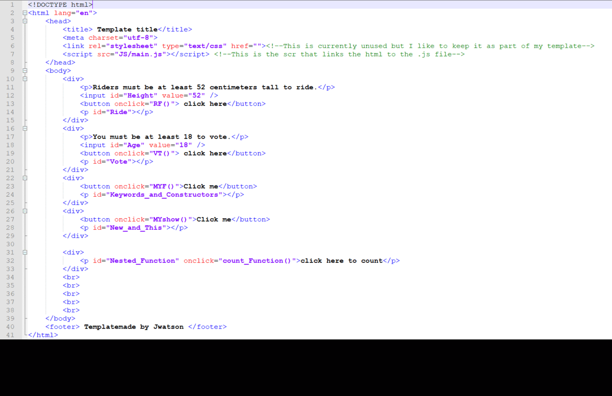
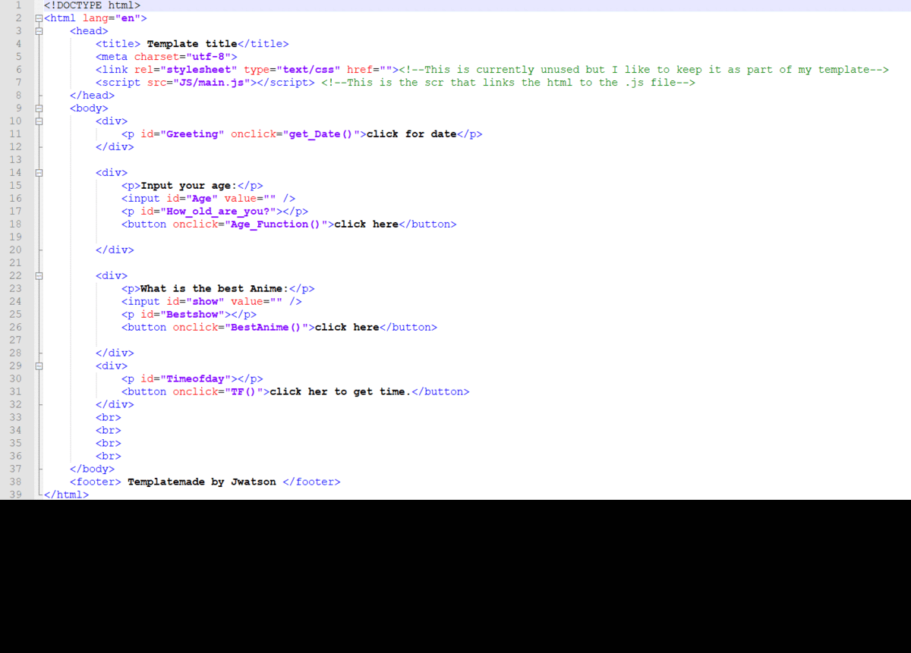
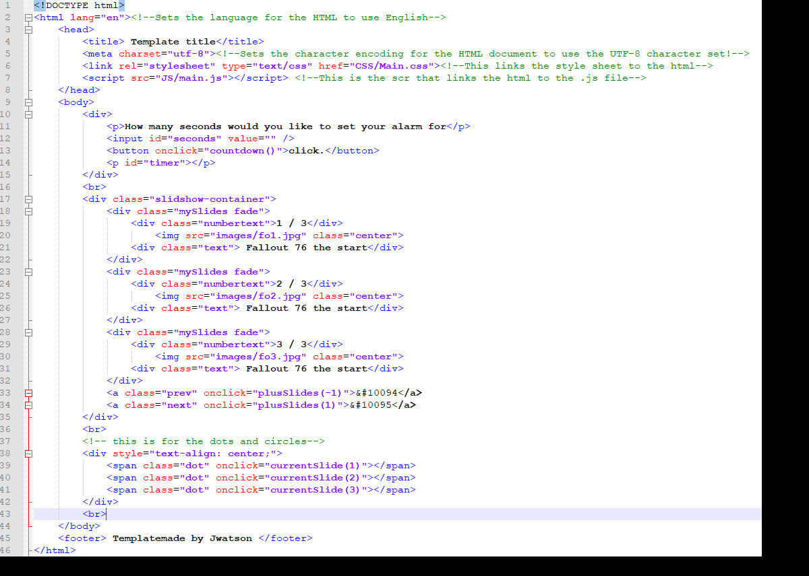
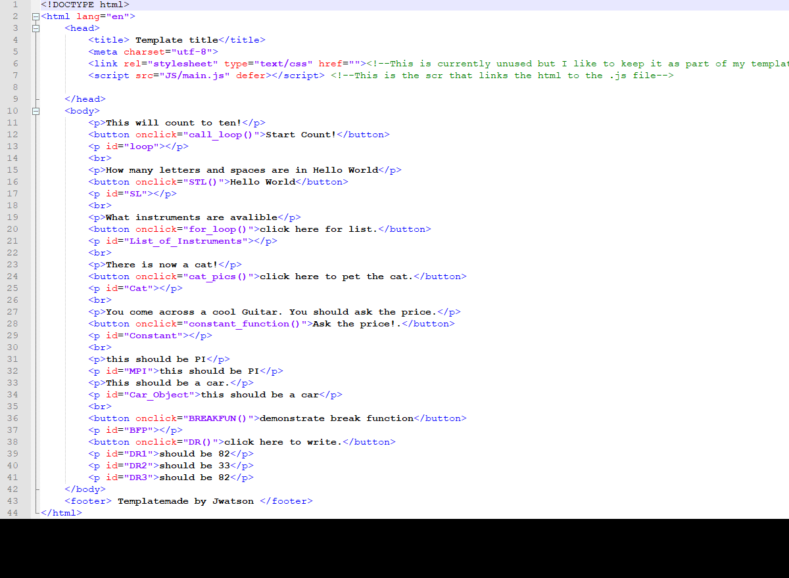

<!-- =================================================================  Begining of Document  ============================================================================= -->
# Basic-JavaScript-Projects
<!-- PROJECT LOGO -->

   
  <h3 align="center">JavaScript Projects</h3>
  

    Tech Academy JavaScript Course Repository.
  

  

   <a href=mailto:watson0117@gmail.com?>Email Me</a>
   ●
   <a href=https://www.linkedin.com/in/joshwatson0117>Linckedin</a>
  ●
   <a href=https://github.com/Watson0117>Main Github</a>
  

<!-- =================================================================  About The repository  ============================================================================= -->
## About The repository

This repository serves as a record of all the files and projects completed during The Tech Academy's Python course. Below are programs and modules that I have used within the course. I have a beginning knowledge base to which I can expand my knowledge. At this point in time I can get a set of instructions and then work on accomplishing them by incorporating what I do know and through research of anything I don't know.
Most of these projects are simple proof of concept projects. They are very basic and the descriptions may be basic or nonexistent
<!-- ================================================================= End About The repository  ============================================================================ -->

<!-- ================================================================= TABLE OF CONTENTS ============================================================================= -->
## Table of Contents 
  <ul>
    <li><a href="#about-the-repository">About The Repository</a></li>
    <li><a href="#built-with">Built With</a></li>
    <li><a href="#projects">Projects</a></li>
    <ul>
       <li><a href="#project1_expressions_alert">Project1_expressions_alert</a></li>
       <li><a href="#project2_functions">Project2_functions</a></li>
       <li><a href="#project3_math_operators">Project3_math_operators</a></li>
       <li><a href="#project4_dictionaries">Project4_dictionaries</a></li>
       <li><a href="#project5_comparisons_type_coercion">Project5_comparisons_type_coercion</a></li>
       <li><a href="#project6_ternary__operators_constructors">Project6_ternary__operators_constructors</a></li>
       <li><a href="#project7_scope_time_function">Project7_scope_time_function</a></li>
       <li><a href="#project8_string_methods">Project8_string_methods</a></li>
       <li><a href="#project9_countdown_slideshow">Project9_countdown_slideshow</a></li>
       <li><a href="#project10_loops_arrays">Project10_loops_arrays</a></li>
      </ul>
    <li><a href="#contact">Contact</a></li>
  </ul>
  <!-- ================================================================= End TABLE OF CONTENTS ============================================================================= -->
  
<!-- ========================================================================  Built With  ================================================================================= -->
## Built With
These tools comprise the majority of what was used to make the programs held within this repository.
<table style="width:100%">
 <tr>
   <td><b style="font-size:30px"><a href="https://www.javascript.com/resources">JavaScript</a></b></td>
   <td><b style="font-size:30px"><a href="https://www.djangoproject.com/">Django</a></b></td>
   <td><b style="font-size:30px"><a href="https://code.visualstudio.com/docs">Visiual Studio Code</a></b></td>
   <td><b style="font-size:30px"><a href="https://reactjs.org/docs/getting-started.html">ReactJS</a></b></td>
 </tr>
</table>
<!-- =================================================================  End Built With  ============================================================================= -->

<!-- =================================================================  Projects  =================================================================================== -->
## Projects
These projects were covered in the course and each represents a specific concept or technique. Each is quite small and very simple but represents what I have done as a base.  
### Project1_expressions_alert
 

<a href="#table-of-contents">Back to Contents</a>
 

### Project2_functions
 

<a href="#table-of-contents">Table of Contents</a>
 

### Project3_math_operators
 

<a href="#table-of-contents">Back to Contents</a>
 

### Project4_dictionaries
 

<a href="#table-of-contents">Back to Contents</a>
 

### Project5_comparisons_type_coercion
 

<a href="#table-of-contents">Back to Contents</a>
 

### Project6_ternary__operators_constructors
 

<a href="#table-of-contents">Back to Contents</a>
 

### Project7_scope_time_function
 

<a href="#table-of-contents">Back to Contents</a>
 

### Project8_string_methods
 

<a href="#table-of-contents">Back to Contents</a>
 

### Project9_countdown_slideshow
 

<a href="#table-of-contents">Back to Contents</a>
 

### Project10_loops_arrays">Project10_loops_arrays
 

<a href="#table-of-contents">Back to Contents</a>
 
<!-- =================================================================  End Projects  =================================================================================== -->

<!-- =================================================================  Contact  ============================================================================= -->
## Contact
 
Email: [watson0117@gmail.com](mailto:watson0117@gmail.com) 
Linkedin: [JoshWatson0117](www.linkedin.com/in/JoshWatson0117) 
Project Link: [https://github.com/Watson0117/Basic-JavaScript-Projects](https://github.com/Watson0117/Basic-JavaScript-Projects) 
Main GitHub Link: [https://github.com/Watson0117](https://github.com/Watson0117) 
<!-- ================================================================= End Contact  ============================================================================= -->

<!-- =================================================================  End Document  ============================================================================= -->
